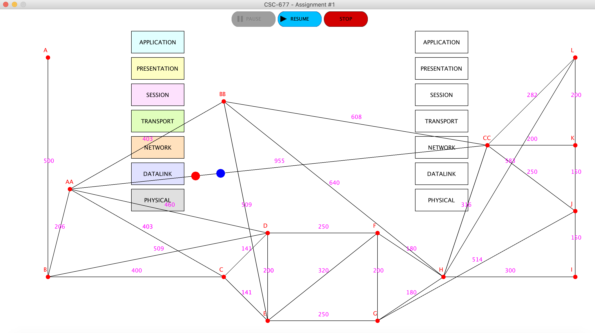

<h1 align="center">Network Simulator</h1>

  

       
        

Network Simulator is a three-part project for my Principles of Computer Networks class at UNC Greensboro (Fall 2020). It emulates packets going through a network, tne transport protocol, etc. Not many details are available at the moment due to its very early stage of development.

## Dependencies

There are no dependencies for this project.

## Rebuilding Network Simulator
NetBeans 8.2 is used to build this project. However, in recent updates, the NetBeans files have been removed to make the project IDE-independent. To make this into a project in your IDE, create a new project, then clone this repository into the root of your project with the "." operator (i.e. make sure you clone it **here** and not in a subfolder!).

## Reporting Bugs

See the Issues Tab.

## Version History
The **master** branch encompasses all changes. A **development** branch is in the works.
