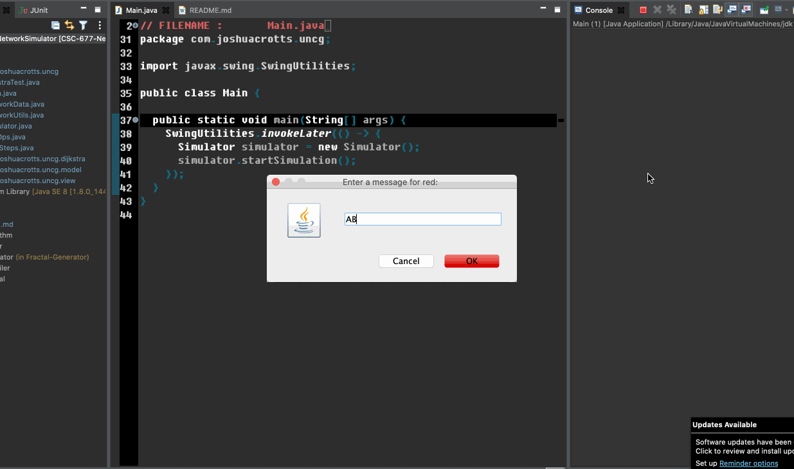

<h1 align="center">Network Simulator</h1>

  

        

Network Simulator is a three-part project for my Principles of Computer Networks class at UNC Greensboro (Fall 2020). It emulates packets going through a network, the transport, network, data-link, and physical layers in the OSI model. It also uses Dijkstra's algorithm where each packet chooses the route with the shortest path.

## Dependencies

There are no dependencies for this project.

## Rebuilding Network Simulator
Eclipse is used to build this project. However, in recent updates, the Eclipse files have been removed to make the project IDE-independent. To make this into a project in your IDE, create a new project, then clone this repository into the root of your project with the "." operator (i.e. make sure you clone it **here** and not in a subfolder!). Make sure to add the /res/ and /src/ files to the Java build path of your environment so all resources are loaded and initialized.

## Reporting Bugs

See the Issues Tab.

## Version History
The **master** branch encompasses all changes. A **development** branch contains periodic evolutions.
